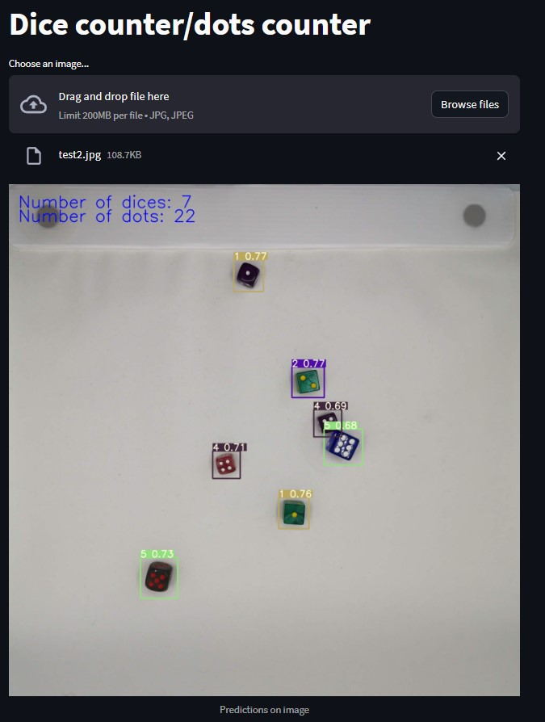

# dice_detection

In this project, I developed a dice detection system using the YOLOv7 model. The main objective was to train the model to accurately identify number of dots in images and. I also added counter for dices. I used a dataset consisting of 250 images of various dice configurations. This dataset was divided into a training set and a validation set, with 200 images for training and 50 images for validation.

[dataset](https://www.kaggle.com/datasets/nellbyler/d6-dice)



# Run Demo Locally

You can directly run Streamlit locally in the repo root folder as follows:

```shell
python -m venv venv
venv\Scripts\activate //inside project directory
pip install -r requirements.txt
streamlit run app.py
```
Before runnning the streamlit app, remember to add model and image inside project directory
